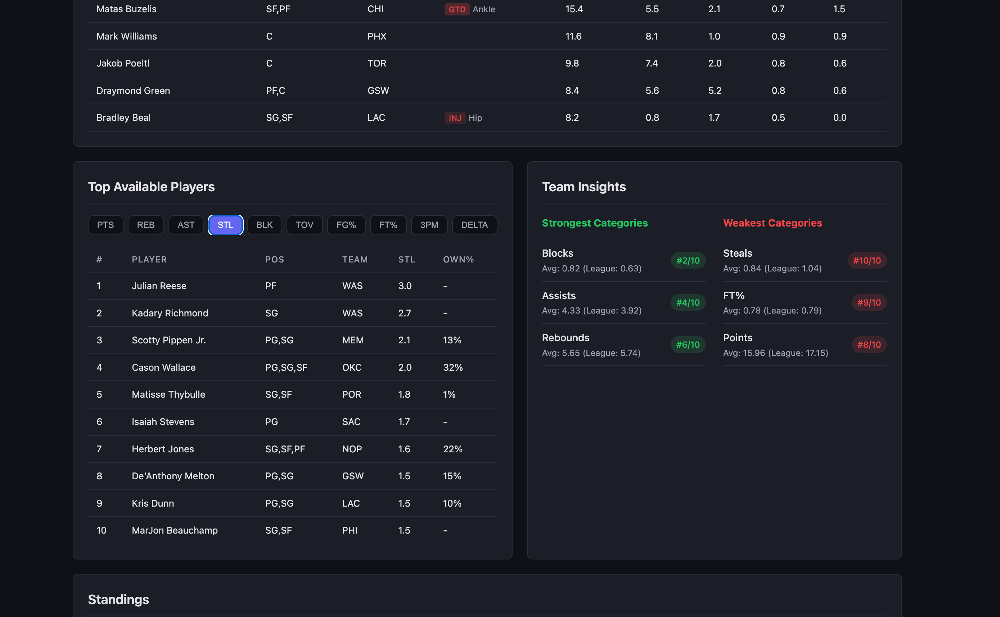

# Fantasy Basketball Helper 🏀

A local-first Yahoo Fantasy Basketball analytics tool built with Spring Boot and React.

## Features

- 📊 **League Overview** - View all your Yahoo Fantasy leagues
- 👥 **Team Dashboard** - Detailed stats for your team
- 📈 **Standings** - Real-time league standings with W-L-T records
- 🤝 **Matchup Analysis** - Week-by-week category matchup tracking
- 🎯 **Player Recommendations** - Top available players by category (PTS, REB, AST, STL, BLK, etc.)
- 💡 **Team Insights** - Identify your strongest and weakest categories
- 🔄 **Data Sync** - One-click sync with Yahoo Fantasy API
- 


## Tech Stack

**Backend:**
- Java 21
- Spring Boot 4
- PostgreSQL 16
- Redis 7 (caching layer)
- Flyway migrations
- Yahoo OAuth 2.0

**Frontend:**
- React 19
- TypeScript
- Vite
- React Router

---

## 🚀 Getting Started

This guide will walk you through setting up the project from scratch. Choose either Docker (easiest) or local development.

### Prerequisites

Before you begin, install these tools:

**For Docker Setup (Recommended):**
- [Docker Desktop](https://www.docker.com/products/docker-desktop/) (includes Docker and Docker Compose)
- [Git](https://git-scm.com/downloads)

**For Local Development:**
- [Java 21](https://adoptium.net/) (OpenJDK)
- [Node.js 22+](https://nodejs.org/)
- [Docker Desktop](https://www.docker.com/products/docker-desktop/) (for PostgreSQL database)
- [Git](https://git-scm.com/downloads)

---

## 📦 Setup Instructions

### Step 1: Clone the Repository

Open your terminal and run:

```bash
# Clone the repository
git clone <your-repo-url>

# Navigate into the project directory
cd FB-Yahoo
```

### Step 2: Get Yahoo Developer Credentials

You need credentials from Yahoo to access their Fantasy API:

1. Go to [Yahoo Developer Network](https://developer.yahoo.com/apps/)
2. Log in with your Yahoo account
3. Click **"Create an App"**
4. Fill in the form:
   - **Application Name**: Fantasy Basketball Helper (or your choice)
   - **Application Type**: Web Application
   - **Redirect URI(s)**: `https://localhost:8443/oauth/yahoo/callback`
   - **API Permissions**: Select "Fantasy Sports" (read access)
5. Click **"Create App"**
6. Save your **Client ID** and **Client Secret** (you'll need these next)

### Step 3: Create Environment File

Create a `.env` file with your credentials:

```bash
# Copy the example file
cp .env.example .env
```

Now open `.env` in a text editor and replace the placeholder values:

```bash
# Database Configuration
POSTGRES_HOST=localhost
POSTGRES_PORT=5432
POSTGRES_DB=fbyahoo
POSTGRES_USER=postgres
POSTGRES_PASSWORD=postgres

# Redis Cache (optional password)
REDIS_HOST=localhost
REDIS_PORT=6379
REDIS_PASSWORD=

# Yahoo OAuth - REPLACE THESE WITH YOUR CREDENTIALS
YAHOO_CLIENT_ID=your_yahoo_client_id_here
YAHOO_CLIENT_SECRET=your_yahoo_client_secret_here
YAHOO_REDIRECT_URI=https://localhost:8443/oauth/yahoo/callback

# SSL Certificate (leave blank for default)
SSL_KEYSTORE_PASSWORD=

# Spring Boot Profile
SPRING_PROFILES_ACTIVE=prod
```

**Important:** Replace `your_yahoo_client_id_here` and `your_yahoo_client_secret_here` with the actual values from Step 2.

### Step 4: Generate SSL Certificate

The app requires HTTPS (Yahoo mandates this for OAuth). You'll need to create a self-signed certificate for local development.

#### Option A: Using mkcert (Recommended)

[mkcert](https://github.com/FiloSottile/mkcert) is a simple tool for creating trusted local certificates.

**Install mkcert:**

```bash
# macOS
brew install mkcert
brew install nss # for Firefox support

# Linux
sudo apt install mkcert  # Debian/Ubuntu
# OR
sudo pacman -S mkcert    # Arch Linux

# Windows
choco install mkcert     # using Chocolatey
# OR download from: https://github.com/FiloSottile/mkcert/releases
```

**Generate certificate:**

```bash
# Install local CA (one-time setup)
mkcert -install

# Generate certificate for localhost
mkcert -pkcs12 -p12-file secrets/keystore.p12 localhost 127.0.0.1 ::1

# You'll be prompted to create a password - press Enter for no password
# (This matches the empty SSL_KEYSTORE_PASSWORD in .env)
```

#### Option B: Using Java keytool

If you can't install mkcert, use Java's built-in keytool:

```bash
# Create secrets directory
mkdir -p secrets

# Generate self-signed certificate
keytool -genkeypair -alias localhost -keyalg RSA -keysize 2048 \
  -storetype PKCS12 -keystore secrets/keystore.p12 \
  -dname "CN=localhost, OU=Development, O=FBYahoo, L=City, ST=State, C=US" \
  -validity 3650 -storepass "" -keypass ""

# Press Enter when prompted for passwords (leave blank)
```

**Verify certificate was created:**

```bash
ls -la secrets/keystore.p12
# Should show a file ~3KB in size
```

**Note:** Your browser will show a security warning (this is normal for self-signed certificates). Click "Advanced" → "Proceed to localhost" to continue.

**For mkcert users:** The certificate will be automatically trusted by your browser (no security warning).

---

## 🐳 Option A: Run with Docker (Recommended)

This is the easiest way to run the complete application.

### Start the Application

```bash
# Start all services (database + backend + frontend)
docker compose up --build
```

This will:
1. Build the React frontend
2. Build the Spring Boot backend
3. Start PostgreSQL database
4. Run database migrations
5. Start the application

**Wait for:** You'll see `Started FbYahooApplication` in the logs (takes 1-2 minutes on first run).

### Access the Application

1. Open your browser to: **https://localhost:8443**
2. Accept the SSL certificate warning (click "Advanced" → "Proceed")
3. Click **"Login with Yahoo"**
4. Authorize the app when prompted by Yahoo
5. You'll be redirected back to the app

### First-Time Usage

After logging in:

1. Click **"Sync Data"** button to pull your leagues from Yahoo
2. Wait for sync to complete (~30 seconds)
3. Click on any league to view your dashboard
4. Explore standings, matchups, and player recommendations

### Stopping the Application

Press `Ctrl+C` in the terminal, or run:

```bash
docker compose down
```

To completely reset (delete all data):

```bash
docker compose down -v
```

---

## 💻 Option B: Local Development (Hot Reload)

For active development with auto-reload on code changes.

### 1. Start Dependencies (Database + Redis)

```bash
docker compose up -d db redis
```

This starts PostgreSQL and Redis in the background.

### 2. Build and Run the Backend

```bash
# Build and run Spring Boot
./gradlew bootRun
```

Wait for the message: `Started FbYahooApplication`

The backend runs at **https://localhost:8443**

### 3. Run the Frontend (in a new terminal)

Open a **new terminal window** (keep the backend running):

```bash
# Navigate to frontend directory
cd frontend

# Install dependencies (first time only)
npm install

# Start development server
npm run dev
```

The frontend runs at **https://localhost:5173**

### Access the Application

1. Open your browser to: **https://localhost:5173** (frontend dev server)
2. The frontend will proxy API requests to the backend
3. Follow the "First-Time Usage" steps from the Docker section above

### Making Changes

- **Frontend changes**: Auto-reload in browser (React Fast Refresh)
- **Backend changes**: Stop backend (`Ctrl+C`), then restart with `./gradlew bootRun`
- **Database schema changes**: Create new migration in `src/main/resources/db/migration/`

### Stopping Development Servers

- Backend: Press `Ctrl+C` in the backend terminal
- Frontend: Press `Ctrl+C` in the frontend terminal  
- Database: `docker compose down`

---

## 🧪 Running Tests

```bash
# Run all tests
./gradlew test

# Run a specific test class
./gradlew test --tests "com.example.fbyahoo.SomeTest"

# Run a specific test method
./gradlew test --tests "com.example.fbyahoo.SomeTest.methodName"

# Run cache-specific tests
./gradlew test --tests "com.example.fbyahoo.service.LeagueReadServiceCacheTest"
./gradlew test --tests "com.example.fbyahoo.controller.api.SyncEvictsCachesTest"

# Run tests with coverage report
./gradlew test jacocoTestReport
# Open: build/reports/jacoco/test/html/index.html
```

**Test Infrastructure:**
- **Redis in tests**: Uses in-memory `ConcurrentMapCacheManager` (no Redis container needed)
- **Cache tests**: Verify `@Cacheable` and `@CacheEvict` behavior
- **Configuration**: `TestCacheConfig.java` provides test-only cache manager

---

## 📚 Project Structure

```
.
├── src/main/java/com/example/fbyahoo/
│   ├── config/           # Spring Security, CORS, WebClient
│   ├── controller/
│   │   ├── api/          # REST API endpoints
│   │   └── ingestion/    # Yahoo API ingestion triggers
│   ├── service/
│   │   ├── ingestion/    # Yahoo Fantasy API services
│   │   └── TokenService.java  # OAuth token management
│   ├── model/            # JPA entities
│   ├── repo/             # Spring Data repositories
│   └── dto/api/          # API response DTOs
├── src/main/resources/
│   ├── db/migration/     # Flyway SQL migrations
│   ├── application.properties
│   └── keystore.p12      # SSL certificate (copied to secrets/)
├── frontend/
│   ├── src/
│   │   ├── api/          # API client
│   │   ├── components/   # React components
│   │   ├── context/      # Auth context
│   │   ├── pages/        # Route pages
│   │   └── types/        # TypeScript types
│   └── vite.config.ts
├── secrets/
│   └── keystore.p12      # SSL certificate (gitignored)
├── .env                  # Environment variables (gitignored)
├── .env.example          # Template for .env
├── docker-compose.yml    # Docker services definition
├── Dockerfile            # Multi-stage build (frontend + backend)
├── start.sh              # Quick start script
└── README.md             # You are here
```

---

## 🔌 API Endpoints

| Method | Path | Description |
|--------|------|-------------|
| GET | `/api/auth/status` | Check authentication status |
| GET | `/api/leagues` | List all your leagues |
| GET | `/api/leagues/{key}` | League detail + your team |
| GET | `/api/leagues/{key}/roster` | Your roster with stats |
| GET | `/api/leagues/{key}/available` | Top available players |
| GET | `/api/leagues/{key}/standings` | League standings |
| GET | `/api/leagues/{key}/matchup` | Current matchup details |
| GET | `/api/leagues/{key}/insights` | Team strength/weakness insights |
| POST | `/api/sync` | Sync all data from Yahoo API |

**Authentication:** All endpoints (except auth) require a valid Yahoo OAuth token.

---

## 🗄️ Database Schema

The database uses Flyway migrations for version control (located in `src/main/resources/db/migration/`).

**Core Tables:**

- **`oauth_token`** - Single-row Yahoo OAuth token storage (auto-refresh enabled)
- **`league`** - Yahoo Fantasy leagues (31 fields including settings, draft info)
- **`team`** - Teams in leagues (manager info flattened)
- **`player`** - Global player registry (eligibility positions, injury status, editorial data)
- **`player_stats`** - Season averages per game (PTS, REB, AST, 3PM, FG%, FT%, etc.)
- **`player_ownership`** - Ownership percentage and weekly deltas
- **`league_rostered_player`** - Snapshot of rostered players per league
- **`matchup`** - Weekly matchup data
- **`matchup_stat`** - Category-by-category matchup results

**Key Design Decisions:**

- **Single-row token table**: `TokenService` maintains exactly one token per app instance
- **Yahoo key format**: Entities use Yahoo's key format (e.g., `466.l.42086` for leagues, `466.p.5009` for players)
- **Game key 466**: NBA 2024-25 season
- **Flyway-only migrations**: Hibernate is set to `ddl-auto=validate` (never creates/alters tables)

### Redis Caching Layer

The application uses **Redis 7** for caching expensive API read operations. Redis improves response times by storing frequently accessed data in memory.

**Cached Endpoints:**
- `/api/leagues` (league list) → Cache key: static
- `/api/leagues/{key}` (league detail) → Cache key: `leagueKey`
- `/api/leagues/{key}/roster` → Cache key: `leagueKey`
- `/api/leagues/{key}/available` → Cache key: `leagueKey:category:limit`
- `/api/leagues/{key}/standings` → Cache key: `leagueKey`
- `/api/leagues/{key}/matchup` → Cache key: `leagueKey:weekNumber`
- `/api/leagues/{key}/insights` → Cache key: `leagueKey`

**Cache Configuration:**
- **TTL**: 30 minutes (configurable in `CacheConfig.java`)
- **Serialization**: JSON (via `GenericJackson2JsonRedisSerializer` wrapped by a custom `LenientJsonRedisSerializer`)
- **Key Prefix**: `fbyahoo::` (for namespace isolation)
- **Eviction**: All caches cleared on `/api/sync` POST
- **Startup Safety**: All caches are cleared once on app startup to prevent stale/incompatible cache payloads after deploys

**How it works:**
1. **First request** → Database query → Store in Redis → Return result
2. **Subsequent requests** (within 30 min) → Return from Redis (no DB query)
3. **After sync** → All caches evicted → Fresh data on next request

**Configuration** (`application.properties`):
```properties
spring.data.redis.host=${REDIS_HOST:localhost}
spring.data.redis.port=${REDIS_PORT:6379}
spring.data.redis.password=${REDIS_PASSWORD:}
```

**Implementation:**
- `@Cacheable` annotations on read methods in `LeagueReadService`
- `@CacheEvict(allEntries=true)` on `SyncApiController.sync()`
- Cache names defined in `CacheNames.java` constants
- Tests use in-memory `ConcurrentMapCacheManager` (see `TestCacheConfig.java`)

---

## 🛠️ Useful Commands

### Docker Commands

```bash
# Start all services (database + redis + app)
docker compose up --build

# Start in background (detached mode)
docker compose up -d

# Stop all services
docker compose down

# Stop and delete all data (clean slate)
docker compose down -v

# View logs for the app
docker compose logs -f app

# View logs for the database
docker compose logs -f db

# View logs for Redis
docker compose logs -f redis

# Restart just the app service
docker compose restart app

# Rebuild from scratch (no cache)
docker compose build --no-cache
docker compose up
```

### Backend Commands

```bash
# Run Spring Boot
./gradlew bootRun

# Run with custom port
./gradlew bootRun --args='--server.port=9443'

# Compile Java code only
./gradlew compileJava

# Run all tests
./gradlew test

# Build JAR file (for deployment)
./gradlew bootJar

# Clean build directory
./gradlew clean

# Stop Gradle daemon
./gradlew --stop
```

### Frontend Commands

```bash
cd frontend

# Install dependencies (first time or after package.json changes)
npm install

# Start development server with hot reload
npm run dev

# Build for production (outputs to src/main/resources/static/)
npm run build

# Preview production build locally
npm run preview

# Run linter
npm run lint
```

### Database Commands

```bash
# Start only the database
docker compose up -d db

# Connect to PostgreSQL shell
docker exec -it fbyahoo psql -U postgres -d fbyahoo

# Reset database (warning: deletes all data)
docker compose down -v
docker compose up -d db

# Export database
docker exec -t fbyahoo pg_dump -U postgres fbyahoo > backup.sql

# Import database
docker exec -i fbyahoo psql -U postgres fbyahoo < backup.sql
```

### Redis Commands

```bash
# Start only Redis
docker compose up -d redis

# Connect to Redis CLI
docker exec -it fbyahoo_redis redis-cli

# View all cache keys
docker exec -it fbyahoo_redis redis-cli KEYS "fbyahoo::*"

# Clear all caches (flush entire Redis)
docker exec -it fbyahoo_redis redis-cli FLUSHALL

# Clear specific cache namespace
docker exec -it fbyahoo_redis redis-cli --scan --pattern "fbyahoo::*" | xargs docker exec -i fbyahoo_redis redis-cli DEL

# Check Redis memory usage
docker exec -it fbyahoo_redis redis-cli INFO memory

# Monitor live Redis commands (real-time)
docker exec -it fbyahoo_redis redis-cli MONITOR
```

---

## 🐛 Troubleshooting

### OAuth / Authentication Issues

**Problem: "OAuth redirect failed" or "Invalid client" error**

✅ **Solution:**
1. Verify redirect URI in [Yahoo Developer Console](https://developer.yahoo.com/apps/) is exactly: `https://localhost:8443/oauth/yahoo/callback`
2. Check `.env` has correct `YAHOO_CLIENT_ID` and `YAHOO_CLIENT_SECRET`
3. Ensure you copied the **Client Secret**, not the Secret Hash

**Problem: "Token expired" or constantly redirected to login**

✅ **Solution:**
- Token should auto-refresh. Check backend logs for refresh errors
- If broken, clear token: `docker exec -it fbyahoo psql -U postgres -d fbyahoo -c "DELETE FROM oauth_token;"`
- Then re-login through the app

### Data Sync Issues

**Problem: "Sync Data" button does nothing or fails**

✅ **Solution:**
1. Open browser developer console (F12) and check for error messages
2. Ensure you're logged in (token exists in database)
3. Check backend logs: `docker compose logs -f app`
4. Verify you have active Yahoo Fantasy leagues for the current season

**Problem: League data is outdated**

✅ **Solution:**
- Click "Sync Data" to manually refresh from Yahoo
- Data is cached in Redis (30 min TTL) and database until you sync
- Weekly stats update when you sync after games complete
- To force fresh data: Clear Redis cache or wait for TTL expiry

### Database Issues

**Problem: "Connection refused" or "Database not found"**

✅ **Solution:**
```bash
# Check if services are running
docker compose ps

# Start database and Redis if stopped
docker compose up -d db redis

# Check database logs
docker compose logs db

# Check Redis logs
docker compose logs redis

# Verify connection parameters in .env match docker-compose.yml
```

**Problem: Migration errors or schema conflicts**

✅ **Solution:**
```bash
# Reset database (warning: deletes all data)
docker compose down -v
docker compose up -d db

# Migrations will run automatically on next app start
./gradlew bootRun
```

### SSL / HTTPS Issues

**Problem: "Certificate not trusted" or "SSL handshake failed"**

✅ **Solution:**
- This is **expected** for self-signed certificates
- Click "Advanced" → "Proceed to localhost" in your browser
- The certificate is for local development only

**Problem: "Keystore not found" error**

✅ **Solution:**
```bash
# Ensure keystore exists in secrets/
ls -la secrets/keystore.p12

# If missing, generate it (see Step 4 in Getting Started)
# Using mkcert (recommended):
mkcert -pkcs12 -p12-file secrets/keystore.p12 localhost 127.0.0.1 ::1

# OR using keytool:
keytool -genkeypair -alias localhost -keyalg RSA -keysize 2048 \
  -storetype PKCS12 -keystore secrets/keystore.p12 \
  -dname "CN=localhost, OU=Development, O=FBYahoo, L=City, ST=State, C=US" \
  -validity 3650 -storepass "" -keypass ""
```

### Build Issues

**Problem: Frontend build fails with "Node version" error**

✅ **Solution:**
- Vite 7 requires Node.js 22+
- Update Node: [nodejs.org](https://nodejs.org/)
- Or use Docker (includes correct Node version)

**Problem: Java compilation errors**

✅ **Solution:**
- Ensure Java 21 is installed: `java -version`
- Download from: [Adoptium](https://adoptium.net/)

**Problem: "Port already in use" (8443 or 5173)**

✅ **Solution:**
```bash
# Find and kill process on port 8443
lsof -ti:8443 | xargs kill -9

# Or restart your computer (nuclear option)
```

### Docker Issues

**Problem: "Docker daemon not running"**

✅ **Solution:**
- Open Docker Desktop application
- Wait for it to fully start (green icon)

**Problem: Docker build is very slow or stuck**

✅ **Solution:**
```bash
# Increase Docker memory (Docker Desktop → Settings → Resources)
# Minimum 4GB recommended

# Clear Docker cache
docker builder prune -a

# Restart Docker Desktop
```

---

## 📖 Additional Documentation

- **[docs/research/](docs/research/)** - Yahoo API response structure documentation

---

## 🔒 Security Notes

- **SSL Certificate**: You must generate your own `keystore.p12` for local development (see Setup Step 4). This file is gitignored and never committed.
- **Production Certificates**: Never use self-signed certificates in production. Use proper certificates from Let's Encrypt or a commercial CA.
- **Secrets**: Never commit `.env`, `keystore.p12`, or any files in `secrets/` directory to version control.
- **OAuth Token**: Stored in database, auto-refreshes. Clear token if compromised: `DELETE FROM oauth_token;`
- **CSRF**: Disabled for OAuth endpoints (required for Yahoo's flow). Do not re-enable without updating OAuth controllers.

---

## 🤝 Contributing

This is a private project. If you're collaborating:

1. Create a feature branch: `git checkout -b feature/my-feature`
2. Follow existing code patterns in `src/main/java` and existing tests in `src/test/java`
3. Test your changes: `./gradlew test`
4. Commit: `git commit -m "feat: add feature"`
5. Push: `git push origin feature/my-feature`

---

## 📄 License

Private project - Not licensed for redistribution

---

## 💬 Support

If you encounter issues not covered in the troubleshooting section:

1. Check logs: `docker compose logs -f app`
2. Review database state: Connect via `docker exec -it fbyahoo psql -U postgres -d fbyahoo`
3. Verify Yahoo API status: [Yahoo Developer Network Status](https://developer.yahoo.com/)

---

## ✨ Credits

Built with OpenAI Codex
